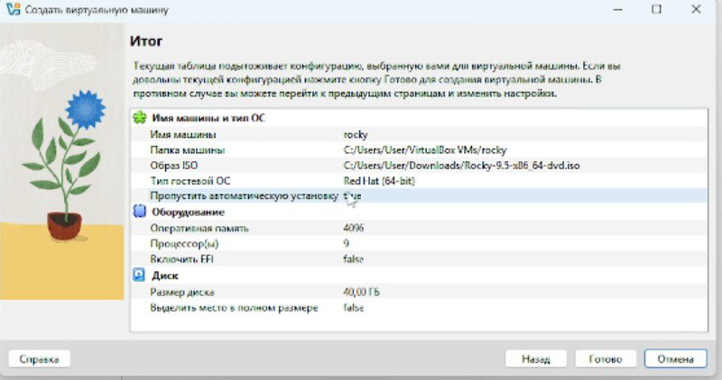

---
## Front matter
lang: ru-RU
title: Установка и конфигурация операционной системы на виртуальную машину.
subtitle: 
author: |
      Ворожейкин Владимир Вячеславович \inst{1}
  
institute:
 \inst{1}Российский университет дружбы народов, Москва, Россия
date: 22 февраля 2025, Москва, Россия

## Formatting
mainfont: PT Serif
romanfont: PT Serif
sansfont: PT Sans
monofont: PT Mono
toc: false
slide_level: 2
theme: metropolis
header-includes: 
 - \metroset{progressbar=frametitle,sectionpage=progressbar,numbering=fraction}
 - '\makeatletter'
 - '\beamer@ignorenonframefalse'
 - '\makeatother'
aspectratio: 43
section-titles: true

---

# Цели и задачи работы

## Цель лабораторной работы

Целью работы является приобретение навыков установки ОС на виртуальную машину, настройки минимально необходимых для работы сервисов.

# Процесс выполнения лабораторной работы

##Создаю виртуальную машину (рис.[-@fig:001]):

 {#fig:001 width=70% height=70%}
 
##Устанавливаю Rocky Linux 9.5 (рис.[-@fig:002]):

 {#fig:002 width=70% height=70%}
 
##Завершаю установку, настраивая параметры (рис.[-@fig:003]):

 {#fig:003 width=70% height=70%}
 
##Подключаю образ диска дополнений гостевой ОС (рис.[-@fig:004]):

 {#fig:004 width=70% height=70%}
 
##С помощью команды получаю информацию о версии ядра Linux(рис.[-@fig:005]):

 {#fig:005 width=70% height=70%}
 
##С помощью соотвествующей команды получаю информацию о частоте процессора(рис.[-@fig:006]):

 {#fig:006 width=70% height=70%}
 
##С помощью специальной команды получаю информацию о объеме доступной оперативной памяти (рис.[-@fig:007]):

 {#fig:007 width=70% height=70%}
 
##Далее выполняю команду по обнаружению типа обнаруженного гипервизора  (рис.[-@fig:008]):

 {#fig:008 width=70% height=70%}
 
##Затем получаю информацию о типе файловой системы корневого раздела(рис.[-@fig:009]):

 {#fig:009 width=70% height=70%}

## Вывод

Во время выполнения данной лабораторной работы я приобрел практические навыки по установке вирутальной машины на свой ПК.

