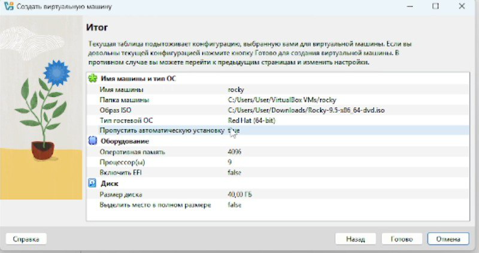
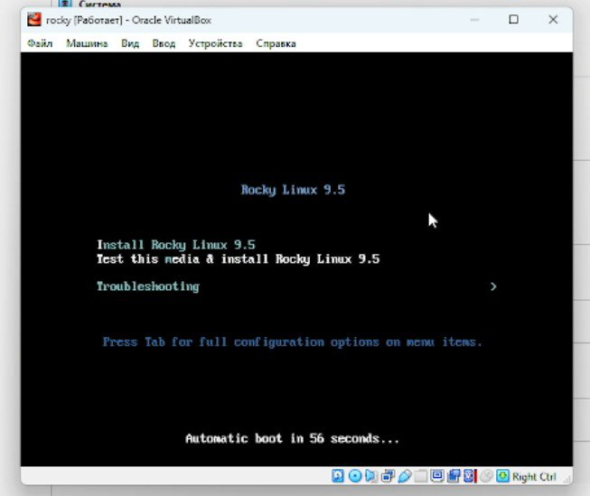
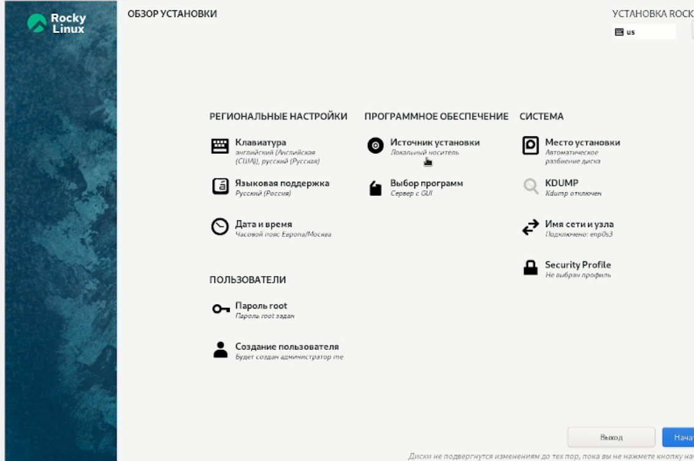
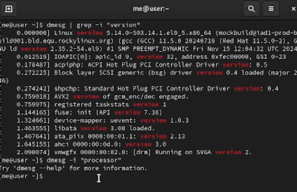
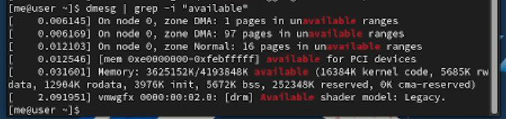
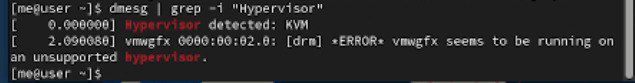
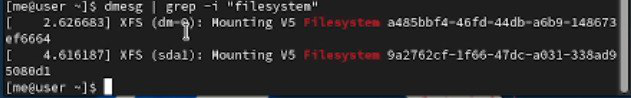

---
## Front matter
title: "Лабораторная работа №1"
subtitle: "Отчет"
author: "Ворожейкин Владимир Вячеславович"

## Generic otions
lang: ru-RU
toc-title: "Содержание"

## Bibliography
bibliography: bib/cite.bib
csl: pandoc/csl/gost-r-7-0-5-2008-numeric.csl

## Pdf output format
toc: true # Table of contents
toc-depth: 2
lof: true # List of figures
lot: true # List of tables
fontsize: 12pt
linestretch: 1.5
papersize: a4
documentclass: scrreprt
## I18n polyglossia
polyglossia-lang:
  name: russian
  options:
	- spelling=modern
	- babelshorthands=true
polyglossia-otherlangs:
  name: english
## I18n babel
babel-lang: russian
babel-otherlangs: english
## Fonts
mainfont: PT Serif
romanfont: PT Serif
sansfont: PT Sans
monofont: PT Mono
mainfontoptions: Ligatures=TeX
romanfontoptions: Ligatures=TeX
sansfontoptions: Ligatures=TeX,Scale=MatchLowercase
monofontoptions: Scale=MatchLowercase,Scale=0.9
## Biblatex
biblatex: true
biblio-style: "gost-numeric"
biblatexoptions:
  - parentracker=true
  - backend=biber
  - hyperref=auto
  - language=auto
  - autolang=other*
  - citestyle=gost-numeric
## Pandoc-crossref LaTeX customization
figureTitle: "Рис."
tableTitle: "Таблица"
listingTitle: "Листинг"
lofTitle: "Список иллюстраций"
lotTitle: "Список таблиц"
lolTitle: "Листинги"
## Misc options
indent: true
header-includes:
  - \usepackage{indentfirst}
  - \usepackage{float} # keep figures where there are in the text
  - \floatplacement{figure}{H} # keep figures where there are in the text
---

#Цель работы

Целью работы является приобретение навыков установки ОС на виртуальную машину, настройки минимально необходимых для работы сервисов.

# Задание

Создание и настройка виртуальной машины.

# Выполнение лабораторной работы

Создаю виртуальную машину (рис.[-@fig:001]):

 {#fig:001 width=70% height=70%}
 
 Устанавливаю Rocky Linux 9.5 (рис.[-@fig:002]):

 {#fig:002 width=70% height=70%}
 
 Завершаю установку, настраивая параметры (рис.[-@fig:003]):

 {#fig:003 width=70% height=70%}
 
 Подключаю образ диска дополнений гостевой ОС (рис.[-@fig:004]):

 {#fig:004 width=70% height=70%}
 
 С помощью команды получаю информацию о версии ядра Linux(рис.[-@fig:005]):

 {#fig:005 width=70% height=70%}
 
 С помощью соотвествующей команды получаю информацию о частоте процессора(рис.[-@fig:006]):

 {#fig:006 width=70% height=70%}
 
С помощью специальной команды получаю информацию о объеме доступной оперативной памяти (рис.[-@fig:007]):

 {#fig:007 width=70% height=70%}
 
 Далее выполняю команду по обнаружению типа обнаруженного гипервизора  (рис.[-@fig:008]):

 {#fig:008 width=70% height=70%}
 
Затем получаю информацию о типе файловой системы корневого раздела(рис.[-@fig:009]):

 {#fig:009 width=70% height=70%}

# Вывод

Во время выполнения данной лабораторной работы я приобрел практические навыки по установке вирутальной машины на свой ПК.

# Список литературы{.unnumbered}

::: https://esystem.rudn.ru/pluginfile.php/2581056/mod_folder/content/0/001-lab_virtualbox.pdf
